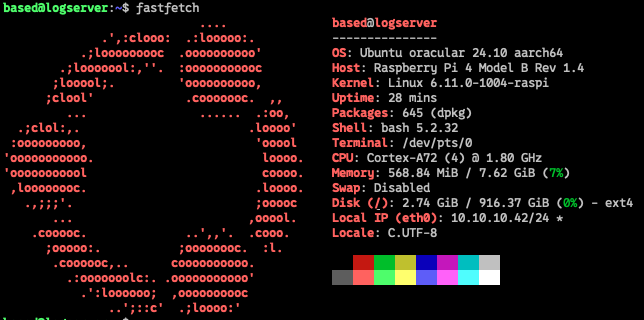
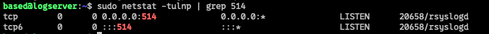

## Installation and Setup of Rsyslog

## System Information
- **Device:** Raspberry Pi 4
- **OS:** Ubuntu 24.10
- **Logging Service:** `rsyslog`
- **Listening Ports:** TCP **514**
- **Firewall:** Configured to allow remote log collection
- **Storage:** 1TB for log retention





**TCP is the only protocol I used for a gurantee of log delivery.**

### 1. Update the System
Ensure your system is up to date:
```sh
sudo apt update && sudo apt upgrade -y
```

### 2. Install `rsyslog`
Most Ubuntu installations come with `rsyslog` pre-installed. If not, install it using:
```sh
sudo apt install rsyslog
```
Verify that the service is running:
```sh
sudo systemctl status rsyslog
```

### 3. Configure rsyslog for Remote Logging
Edit the **rsyslog** configuration file:
```sh
sudo nano /etc/rsyslog.conf
```
Uncomment the following lines to enable TCP reception:
```plaintext
# Provides TCP syslog reception
module(load="imtcp")
input(type="imtcp" port="514")
```
Save and exit the file (`Ctrl + O, Enter, Ctrl + X`).

### 4. Configure Firewall Rules
If **UFW (Uncomplicated Firewall)** is enabled, allow the required ports:
```sh
sudo ufw allow 514/tcp
sudo ufw reload
```

### 5. Restart rsyslog
Apply the changes by restarting the `rsyslog` service:
```sh
sudo systemctl restart rsyslog
```

### 6. Verify Configuration
Check if `rsyslog` is actively listening on the correct ports:
```sh
sudo netstat -tulnp | grep 514
```

If done correctly, you will see listening ports open:


If `netstat` is not installed, you can install it using:
```sh
sudo apt install net-tools
```
