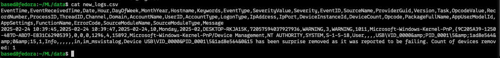

# Moving New Logs From Logserver To ML Host

The hardest part before trainging a ML model, and comparing new logs to detect anamolies, I had to think of a way to detect if new logs have been recieved, process them, and then send them over to be compared against.

## The Bash Script (PI)

```bash
#!/bin/bash

LOG_FILE="/var/log/10.10.10.log"
OUTPUT_DIR="$HOME/CSVs"
REMOTE_USER="based"
REMOTE_HOST="10.10.10.70"
REMOTE_DIR="$HOME/ML/data"
LAST_PROCESSED_FILE="$OUTPUT_DIR/last_position"

# Ensure the output directory exists
mkdir -p "$OUTPUT_DIR"

# Initialize the last processed position if not exists
if [ ! -f "$LAST_PROCESSED_FILE" ]; then
    echo 0 > "$LAST_PROCESSED_FILE"
fi

while true; do
    # Read the last processed byte position
    LAST_POS=$(cat "$LAST_PROCESSED_FILE")

    # Get the current file size
    CURRENT_SIZE=$(stat -c%s "$LOG_FILE")

    # If log file size has increased, process new data
    if [ "$CURRENT_SIZE" -gt "$LAST_POS" ]; then
        echo "New log data detected. Processing..."

        # Extract only the new lines from the log file
        tail -c +$((LAST_POS + 1)) "$LOG_FILE" > "$OUTPUT_DIR/new_logs.txt"

        # Run Go parser on the new logs only
        $HOME/scripts/mainPi "$OUTPUT_DIR/new_logs.txt" "$OUTPUT_DIR/new_logs.csv"

        # Transfer the CSV to the remote Linux machine
        scp "$OUTPUT_DIR/new_logs.csv" "$REMOTE_USER@$REMOTE_HOST:$REMOTE_DIR"

        echo "Logs processed and transferred successfully."

        # Update last processed position
        echo "$CURRENT_SIZE" > "$LAST_PROCESSED_FILE"
    fi

    # Wait 10 seconds before checking again
    sleep 10
done
```

IPs of the hosts are hardcoded, I know. I can solve that with my own DNS or editing a host file, but they are static on my private network, so I am not too worried about them.
This script will look at my catchall log file at /var/log/10.10.10.log for any changes, take the new logs, covert them into a csv file using our Go progam, then send them over to the ML host to perform the comparison.
Is this the cleanest? No, but it works and runs every ten seconds for "real time" log analytics.

## Setting It Up as a Service

The following service file allows me to run the bash script as a service. I was gonna do it as a cron job, but why not learn this new thing of SystemD lol.

Directory: `/etc/systemd/log_monitor.service`

```bash
[Unit]
Description=Log Monitoring and Processing Service
After=network.target

[Service]
User=based
Group=based
WorkingDirectory=/home/based
ExecStart=/bin/bash /home/based/scripts/log_monitor.sh
Restart=always
RestartSec=10
StandardOutput=append:/var/log/log_monitor.log
StandardError=append:/var/log/log_monitor_error.log

[Install]
WantedBy=multi-user.target
```

### Commands to Control the Service

1. `sudo systemctl daemon-reload`
2. `sudo systemctl enable log_monitor.service`
3. `sudo systemctl start log_monitor.service`
4. `sudo systemctl stop log_monitor.service`
5. `sudo systemctl status log_monitor.service`

Logs can be seen at the dirs defined in the service file or with this command:

`journalctl -u log_monitor.service -f`

## Cross Compilation for our Go Log to CSV Parser

I did not think about the problem of using different CPU architecture until I tried to start the bash script above as a service.
I had to cross compile them for the different machines. Luckily, that was easy with Go:

1. RaspberryPi (Logserver) --> `GOOS=linux GOARCH=arm64 go build -o mainPi`
2. x86         (ML Host)   --> `GOOS=linux GOARCH=amd64 go build -o mainx86`

Then I used SCP to transfer the exectuables to the different hosts.

## Verifying New Logs Are Being Sent in CSVs

The log file of the new service was looking like this:

```bash
############### Start Parsing logs ###############
CSV file successfully created: /home/based/CSVs/new_logs.csv
Logs processed and transferred successfully.
New log data detected. Processing...
############### Start Parsing logs ###############
CSV file successfully created: /home/based/CSVs//new_logs.csv
Logs processed and transferred successfully.
New log data detected. Processing...
############### Start Parsing logs ###############
CSV file successfully created: /home/based/CSVs//new_logs.csv
Logs processed and transferred successfully.
New log data detected. Processing...
############### Start Parsing logs ###############
CSV file successfully created: /home/based/CSVs//new_logs.csv
Logs processed and transferred successfully.
New log data detected. Processing...
############### Start Parsing logs ###############
CSV file successfully created: /home/based/CSVs//new_logs.csv
Logs processed and transferred successfully.
New log data detected. Processing...
############### Start Parsing logs ###############
CSV file successfully created: /home/based/CSVs//new_logs.csv
Logs processed and transferred successfully.
New log data detected. Processing...
############### Start Parsing logs ###############
CSV file successfully created: /home/based/CSVs//new_logs.csv
Logs processed and transferred successfully.
New log data detected. Processing...
############### Start Parsing logs ###############
CSV file successfully created: /home/based/CSVs//new_logs.csv
Logs processed and transferred successfully.
```

To do some sanity checking, I looked at the dir that is holding the new CSV to be compared against our ML model.


