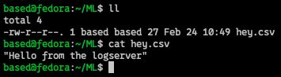

# Configuring ML Server - FedoraOS

In order to send CSV and log data over SCP, we need to enable the openssh service and enable a secure connection from the log server (Raspberry Pi)

## Ensure SSH Server is Installed

```bash
sudo dnf install openssh-server -y
```

## Ensure the SSH Service is Running (Systemd)

```bash
sudo systemctl enable --now sshd
sudo systemctl status sshd
```

The output should look something like this if the service is up and running:


## Set Up SSH Keys

On the logserver, generate an rsa SSH key and copy it over to the ML host:

```bash
ssh-keygen -t rsa -b 4096  # Press ENTER for all prompts
ssh-copy-id based@10.10.10.70  # Copy the key to the remote machine
```

## Testing SCP

Test SCP with a sample file to make sure files can be sent without authenticating.
Here, I have a CSV file (file type does not matter) that contains a message that I sent over to the ML host.


Verify the file has been sent over:


